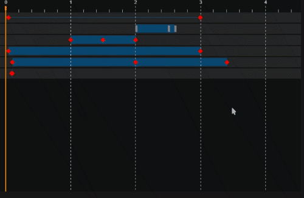

# animation-timeline-control

[npm](https://www.npmjs.com/package/animation-timeline-js)


Animation timeline is a TypeScript, no-dependency, canvas component designed to visualize and manipulate animation keyframes.

Features:

- Fast and customizable, rendered on a canvas.
- Snap, Zoom, Pan mode, multiple keyframes selection.
- Keyboard support.
- Drag multiple keyframes, drag keyframe ranges.
- Area virtualization - only small displayed area is rendered.
- Native browser scrollbars are used.
- Horizontal scale with the automatically adjusted ticks.




## Live Demo

- [Live demo](https://ievgennaida.github.io/animation-timeline-control/)
- [Run unittests](https://ievgennaida.github.io/animation-timeline-control/tests/unittests)

## Configuration

## Usage

### HTML

```JavaScript
   let rows = [
      {
        keyframes: [
          {
            val: 40,
          },
          {
            val: 3000
          }
        ]
      }];

    let timeline = new timelineModule.Timeline({id:'timeline'})

    timeline.setModel({ rows: rows });
```

### Angular

```TypeScript
import {
  Timeline,
  TimelineRow,
  TimelineModel,
  TimelineOptions,
} from "animation-timeline-js";

const model = { rows: [] as Array<TimelineRow> } as TimelineModel;
const options = {
  id: "timeline",
  rowsStyle: {
    height: 35,
  } as TimelineRowStyle,
} as TimelineOptions;

const timeline = new Timeline(options, model);
```

### React

```TypeScript
import React, {useEffect} from 'react';
import {
    Timeline,
    TimelineModel,
    TimelineOptions,
    TimelineRow,
    TimelineRowStyle
} from 'animation-timeline-js';

function ReactTimeline(props: any) {
    useEffect(() => {
        const model = {rows: [] as Array<TimelineRow>} as TimelineModel;
        const options = {
            id: "timeline",
            rowsStyle: {
                height: 35,
                marginBottom: 2,
            } as TimelineRowStyle,
        } as TimelineOptions;
        const timeline = new Timeline(options, model);
    }, [])
    return (
        <>
            <footer>
                <div id={"timeline"}>
                </div>
            </footer>
        </>
    );
}

export default ReactTimeline;
```

For a full working example visit the following
[Animation Timeline Control React Example](https://github.com/crushingCodes/animation-timeline-control-react-example)


### Outline list

Outline list\tree can implemented as a separate HTML component and synchronized with the timeline.
See the [live demo](https://ievgennaida.github.io/animation-timeline-control/)


## Model

Read only and defined by the interfaces:

- TimelineModel
- TimelineRow
- TimelineKeyframe

### Events

| Event name      | description                                                                                 |
| --------------- | ------------------------------------------------------------------------------------------- |
| timeChanged     | time changed. source can be used to check event sender. args type: TimelineTimeChangedEvent |
| selected        | keyframe is selected. args type: TimelineSelectedEvent                                      |
| scroll          | On scroll. args type: TimelineScrollEvent                                                   |
| dragStarted     | emitted on drag started. args type: TimelineDragEvent                                       |
| drag            | emitted when dragging. args type: TimelineDragEvent                                         |
| dragFinished    | emitted when drag finished. args type: TimelineDragEvent                                    |
| KeyframeChanged | emitted when drag finished. args type: TimelineKeyframeChangedEvent                         |

Events can be prevented by calling args.preventDefault()

Example of the type strict event subscription:

```TypeScript
this.timeline.onDragStarted((args: TimelineDragEvent) => {
    if (args) {
    }
});
```

### Timeline units and position

Time indicator position can be changed by a method call:

```JavaScript
timeline.setTime(1000);
```

Current time can be fetched by a method call or by an event:
```TypeScript
let units = timeline.getTime();

timeline.onTimeChanged((event: TimelineTimeChangedEvent) => {
  if(event.source !== TimelineEventSource.User) {
    units = event.var;
  }
});
```

Displayed units text can be changed by overriding a method:

```JavaScript
timeline._formatUnitsText = (val)=> { return val + ' ms'; };
```

### Styling

Styles are applied by a global settings and can be overridden by a row or keyframe style.

## Changes

## > 2.0

- Migrated to TypeScript, Webpack, Babel.
- API is refined.

## < 2.0

Vanilla js implementation.

## Development

### Build

run once to install development references:

```bash
  npm install
```

to pack JavaScript as a bundle:

```bash
  npm run build
```

### Debug

VSCode can be used to debug the component with the next extensions:

- Debugger for Chrome
- Live HTML PReviewer.

Also embedded chrome debugger can be used when demo page is running.

### Build Tests

To build TypeScript unittests command should be executed:

```bash
  npm run build-tests
```

### Run Tests

Tests execution can be started by opening tests/unittests.html.
Mocha test libs are hosted on the internet, so connection is required.

## License

MIT
